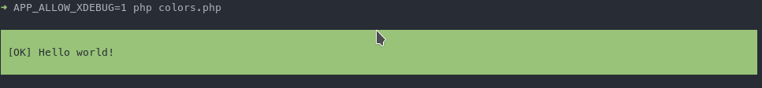

# Bug Reproducer
`Composer\XdebugHandler` does not detect properly TTY support in restarted process.

## Reproducer `colors.php`

Requirements: `xdebug` and extension enabled

1. At first run command without restarting process

    ```bash
    ➜ APP_ALLOW_XDEBUG=1 php colors.php
    ```
    
    Output:

    


2. Then, execute script without `APP_ALLOW_XDEBUG` environment variable

    ```bash
    ➜ php colors.php
    ```

    Output:
    
    

